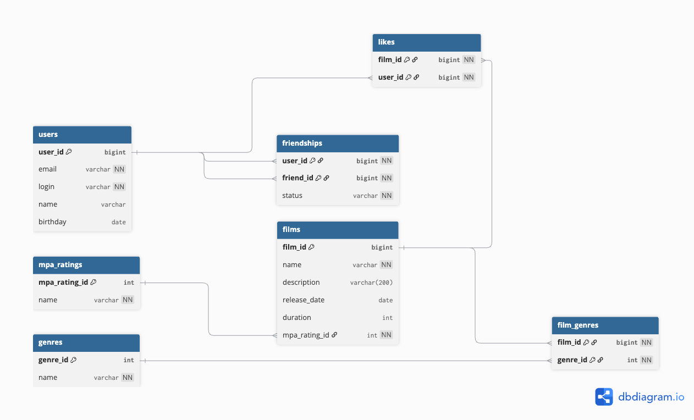

# java-filmorate

REST-сервис для оценки фильмов и управления списком друзей.

---

## Схема базы данных




// Один пользователь может инициировать много запросов дружбы
// Один пользователь может получить много запросов дружбы
// Один фильм может получить много лайков (многие-ко-многим users <-> films через likes)
// Один пользователь может поставить много лайков
// Один фильм может относиться ко многим жанрам (многие-ко-многим films <> genres)
// Один жанр может принадлежать многим фильмам 

### Описание таблиц

| Таблица | Назначение |
|---|---|
| `users` | Пользователи приложения |
| `friendships` | Связи дружбы между пользователями (статус: `UNCONFIRMED` / `CONFIRMED`) |
| `films` | Каталог фильмов |
| `mpa_ratings` | Справочник рейтингов MPA (G, PG, PG-13, R, NC-17) |
| `genres` | Справочник жанров (Комедия, Драма, Мультфильм, Триллер, Документальный, Боевик) |
| `film_genres` | Связь «многие ко многим» между фильмами и жанрами |
| `likes` | Лайки пользователей к фильмам |


---

## Примеры SQL-запросов

### Получить все фильмы

```sql
SELECT f.film_id,
       f.name,
       f.description,
       f.release_date,
       f.duration,
       m.name AS mpa_rating
FROM films f
LEFT JOIN mpa_ratings m ON f.mpa_rating_id = m.mpa_rating_id;
```

### Получить все жанры конкретного фильма

```sql
SELECT g.genre_id, g.name
FROM genres g
JOIN film_genres fg ON g.genre_id = fg.genre_id
WHERE fg.film_id = ?;
```

### Получить топ-N наиболее популярных фильмов (по количеству лайков)

```sql
SELECT f.film_id,
       f.name,
       COUNT(l.user_id) AS likes_count
FROM films f
LEFT JOIN likes l ON f.film_id = l.film_id
GROUP BY f.film_id, f.name
ORDER BY likes_count DESC
LIMIT ?;
```

### Получить всех пользователей

```sql
SELECT user_id, email, login, name, birthday
FROM users;
```

### Получить друзей пользователя

```sql
SELECT u.user_id, u.email, u.login, u.name, u.birthday
FROM users u
JOIN friendships f ON u.user_id = f.friend_id
WHERE f.user_id = ?;
```

### Получить список общих друзей двух пользователей

```sql
SELECT u.user_id, u.email, u.login, u.name, u.birthday
FROM users u
JOIN friendships f1 ON u.user_id = f1.friend_id AND f1.user_id = ?
JOIN friendships f2 ON u.user_id = f2.friend_id AND f2.user_id = ?;
```

### Добавить лайк фильму

```sql
INSERT INTO likes (film_id, user_id) VALUES (?, ?);
```

### Удалить лайк

```sql
DELETE FROM likes WHERE film_id = ? AND user_id = ?;
```

### Отправить запрос дружбы (неподтверждённая)

```sql
INSERT INTO friendships (user_id, friend_id, status)
VALUES (?, ?, 'UNCONFIRMED');
```

### Подтвердить дружбу (обновить обе записи)

```sql
UPDATE friendships SET status = 'CONFIRMED'
WHERE (user_id = ? AND friend_id = ?)
   OR (user_id = ? AND friend_id = ?);
```
